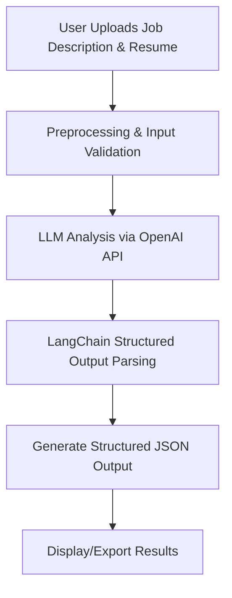

# AI Resume System - Project Guide

## Project Overview

The AI Resume System is designed to assist HR departments in evaluating candidate resumes against job descriptions using advanced AI techniques. The system leverages OpenAI's LLM (via API) and LangChain for orchestrating the analysis and ensuring structured outputs. The goal is to extract relevant skills and experience from resumes, compare them to job requirements, and output a structured JSON with a matching score, matched/missing skills and experience, and other relevant insights.

## High-Level System Flow



## Key Components

- **Input Handler**: Accepts job description and resume (PDF, DOCX, or text).
- **Preprocessing**: Extracts text from documents, validates input, and sanitizes for prompt injection prevention.
- **LLM Orchestrator**: Uses LangChain to manage prompt construction, OpenAI API calls, and output parsing.
- **Output Formatter**: Ensures output is a structured JSON with required fields (matching score, matched/missing skills, etc.).
- **UI/CLI (Phase 2)**: Simple interface for HR users (optional for MVP).

## Proposed Project File Structure

```
AI-prep3/
├── main.py                  # Entry point for the system
├── resume_parser.py         # Handles resume/job description extraction & preprocessing
├── llm_orchestrator.py      # LangChain/OpenAI logic for analysis & output structuring
├── output_formatter.py      # Ensures output JSON structure & post-processing
├── utils.py                 # Utility functions (validation, logging, etc.)
├── PROJECT_GUIDE.md         # This project guide
├── PROGRESS_TRACKING.md     # Progress tracking document
├── requirements.txt         # Python dependencies
├── .env                     # Environment variables (OpenAI API key, etc.)
├── stampli.png              # Stampli logo for UI (future phase)
├── tests/                   # Unit and integration tests
│   ├── test_resume_parser.py
│   ├── test_llm_orchestrator.py
│   └── test_output_formatter.py
```

## Implementation Phases

1. **Core Functionality**
   - Input handling & validation
   - Resume/job description text extraction
   - LLM analysis & structured output
   - Output formatting
2. **Testing & Error Handling**
   - Unit tests for each component
   - Error scenarios & edge cases
3. **UI/UX (Optional, Phase 2)**
   - Simple web or CLI interface
   - Incorporate Stampli branding

## Technologies & Libraries

- **Python 3.10**
- **OpenAI API** (LLM analysis)
- **LangChain** (orchestration & structured output)
- **pypdf, python-docx, beautifulsoup4** (document parsing)
- **tiktoken** (token counting)
- **pytest** (testing)

## Security & Performance

- Prompt injection prevention
- Input validation
- API key management via .env
- Token counting for cost estimation
- Progress indicators for long operations

## Next Steps

- Create PROGRESS_TRACKING.md
- Implement core modules as per the plan
- Test each component individually
